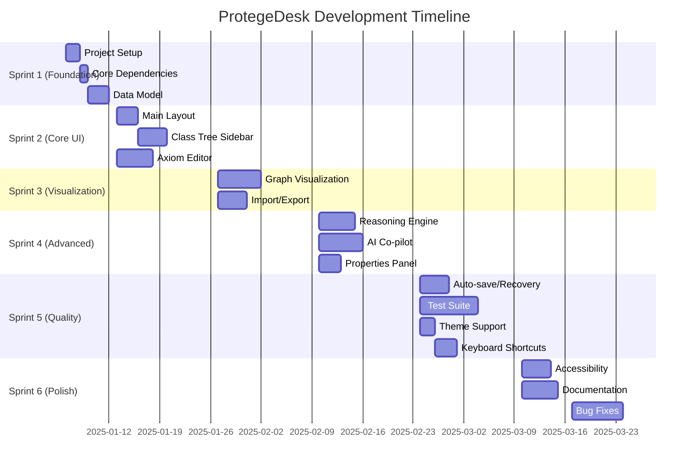

# ProtegeDesk Development Roadmap

## Overview
This roadmap outlines the development plan for ProtegeDesk - a modern, web-based ontology editor with AI assistance.

## Timeline



## Sprints

### Sprint 1: Foundation (Week 1-2) - Jan 6-17, 2025

**Goal**: Establish project foundation and core architecture

| Issue | Title | Assignee | Priority | Status |
|-------|-------|----------|----------|--------|
| [#1](https://github.com/aadorian/ProtegeDesk/issues/1) | Set up project structure with TypeScript/React/Next.js | Alex Chen | High | Open |
| [#2](https://github.com/aadorian/ProtegeDesk/issues/2) | Install and configure core dependencies | Alex Chen | High | Open |
| [#3](https://github.com/aadorian/ProtegeDesk/issues/3) | Implement ontology data model and state management | Alex Chen | High | Open |

**Deliverables**:
- Working Next.js project with TypeScript
- All dependencies installed and configured
- Core ontology data model with state management
- Project builds successfully

---

### Sprint 2: Core UI (Week 3-4) - Jan 20-31, 2025

**Goal**: Build essential user interface components

| Issue | Title | Assignee | Priority | Status |
|-------|-------|----------|----------|--------|
| [#4](https://github.com/aadorian/ProtegeDesk/issues/4) | Create main application layout with resizable panels | Miguel Rodriguez | High | Open |
| [#5](https://github.com/aadorian/ProtegeDesk/issues/5) | Build hierarchical class tree sidebar component | Miguel Rodriguez | High | Open |
| [#6](https://github.com/aadorian/ProtegeDesk/issues/6) | Implement axiom editor with Monaco Editor | Alex Chen | High | Open |

**Deliverables**:
- Working 4-panel layout with resizable sections
- Navigable class tree with search
- Functional axiom editor with syntax highlighting

---

### Sprint 3: Visualization & I/O (Week 5-6) - Feb 3-14, 2025

**Goal**: Enable graph visualization and file operations

| Issue | Title | Assignee | Priority | Status |
|-------|-------|----------|----------|--------|
| [#7](https://github.com/aadorian/ProtegeDesk/issues/7) | Build ontology graph visualization with React Flow | Miguel Rodriguez | High | Open |
| [#8](https://github.com/aadorian/ProtegeDesk/issues/8) | Implement ontology import/export using N3.js | Alex Chen | High | Open |

**Deliverables**:
- Interactive graph visualization with ELK layout
- Import/export support for Turtle, RDF/XML, OWL/XML
- Full round-trip testing

---

### Sprint 4: Advanced Features (Week 7-8) - Feb 17-28, 2025

**Goal**: Add intelligent features and reasoning

| Issue | Title | Assignee | Priority | Status |
|-------|-------|----------|----------|--------|
| [#9](https://github.com/aadorian/ProtegeDesk/issues/9) | Integrate client-side reasoning with EYE-JS WASM | Sarah Johnson | Medium | Open |
| [#10](https://github.com/aadorian/ProtegeDesk/issues/10) | Implement AI co-pilot with LLM integration | Dr. Priya Patel | Medium | Open |
| [#11](https://github.com/aadorian/ProtegeDesk/issues/11) | Add properties panel for entity details editing | Miguel Rodriguez | Medium | Open |

**Deliverables**:
- Working reasoner with consistency checking
- AI-powered command palette
- Properties panel for editing entity details

---

### Sprint 5: Quality & Polish (Week 9-10) - Mar 3-14, 2025

**Goal**: Enhance reliability and user experience

| Issue | Title | Assignee | Priority | Status |
|-------|-------|----------|----------|--------|
| [#12](https://github.com/aadorian/ProtegeDesk/issues/12) | Implement auto-save and crash recovery | James Wilson | Medium | Open |
| [#13](https://github.com/aadorian/ProtegeDesk/issues/13) | Build comprehensive test suite | Lisa Zhang | Medium | Open |
| [#14](https://github.com/aadorian/ProtegeDesk/issues/14) | Implement light/dark theme support | Miguel Rodriguez | Low | Open |
| [#15](https://github.com/aadorian/ProtegeDesk/issues/15) | Add keyboard shortcuts and command palette | Miguel Rodriguez | Low | Open |

**Deliverables**:
- Auto-save with crash recovery
- 80%+ code coverage with tests
- Light/dark theme support
- Comprehensive keyboard shortcuts

---

### Sprint 6: Final Polish (Week 11-12) - Mar 17-28, 2025

**Goal**: Ensure accessibility and complete documentation

| Issue | Title | Assignee | Priority | Status |
|-------|-------|----------|----------|--------|
| [#16](https://github.com/aadorian/ProtegeDesk/issues/16) | Ensure WCAG 2.1 Level AA accessibility | Lisa Zhang | Low | Open |
| [#17](https://github.com/aadorian/ProtegeDesk/issues/17) | Write comprehensive documentation | Emma Davis | Low | Open |

**Deliverables**:
- WCAG 2.1 Level AA compliance
- Complete user and developer documentation
- Bug fixes and performance optimization
- Production-ready release

---

## Milestones

### Milestone 1: Alpha Release (End of Sprint 3) - Feb 14, 2025
- Core editing functionality working
- Basic graph visualization
- Import/export capabilities
- Internal testing ready

### Milestone 2: Beta Release (End of Sprint 4) - Feb 28, 2025
- Reasoning engine integrated
- AI co-pilot functional
- All major features implemented
- Ready for user testing

### Milestone 3: Release Candidate (End of Sprint 5) - Mar 14, 2025
- Comprehensive test coverage
- Auto-save and recovery working
- Performance optimized
- Theme support complete

### Milestone 4: Production Release (End of Sprint 6) - Mar 28, 2025
- WCAG compliant
- Documentation complete
- All issues resolved
- Ready for public release

---

## Team Assignments

### Alex Chen (Lead Developer)
- Issues: #1, #2, #3, #6, #8
- Focus: Core architecture, data model, axiom editor, I/O

### Sarah Johnson (Backend Engineer)
- Issues: #9
- Focus: WASM integration, reasoning engine

### Miguel Rodriguez (UI/UX Developer)
- Issues: #4, #5, #7, #11, #14, #15
- Focus: UI components, graph visualization, themes

### Dr. Priya Patel (AI/ML Engineer)
- Issues: #10
- Focus: LLM integration, AI co-pilot

### James Wilson (DevOps Engineer)
- Issues: #12
- Focus: Persistence, auto-save, CI/CD

### Lisa Zhang (QA Engineer)
- Issues: #13, #16
- Focus: Testing, accessibility, quality assurance

### Emma Davis (Technical Writer)
- Issues: #17
- Focus: Documentation, user guides, API docs

---

## Dependencies

```
High Priority (Foundation):
#1 → #2 → #3 → #4, #6, #8
#3, #4 → #5, #7
#3, #8 → #9
#3, #6 → #10
#3, #4 → #11
#3 → #12

Medium Priority (Enhancement):
All High Priority → #13

Low Priority (Polish):
#4 → #14, #15
All UI → #16
All Features → #17
```

---

## Risk Management

| Risk | Impact | Mitigation |
|------|--------|------------|
| Technical Complexity | High | Pair programming for complex features |
| Performance Issues | High | Early performance testing and optimization |
| Dependency Updates | Medium | Regular dependency updates and security scanning |
| Browser Compatibility | Medium | Cross-browser testing throughout development |
| Accessibility Gaps | Medium | Continuous accessibility testing and review |
| Scope Creep | Medium | Strict adherence to sprint goals and priorities |

---

## Success Metrics

- **Performance**: Handle 1000+ ontology entities at 30+ FPS
- **Test Coverage**: Maintain 80%+ code coverage
- **Accessibility**: WCAG 2.1 Level AA compliance
- **User Experience**: Sub-50ms typing latency in editor
- **Reasoning**: Consistency checking < 5s for 500 classes
- **Documentation**: 100% API coverage

---

## Notes

- This roadmap is based on the GitHub issues created in [github-issues.md](github-issues.md)
- Sprint dates are estimates and may be adjusted based on progress
- Team members should be assigned to their respective issues in GitHub
- Regular sprint reviews and retrospectives should be conducted
- All issues are tracked in the GitHub repository: https://github.com/aadorian/ProtegeDesk

---

**Last Updated**: December 30, 2025
**Next Review**: Start of Sprint 1 (January 6, 2025)
